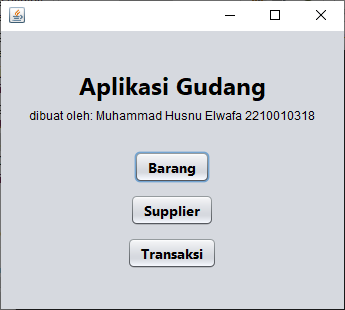
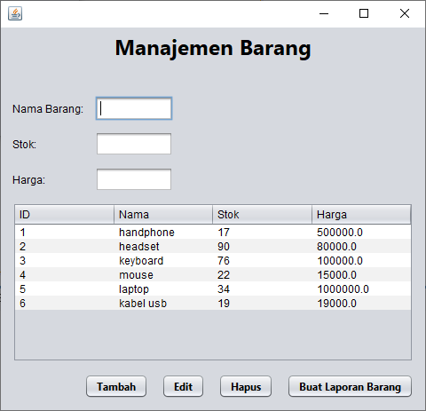
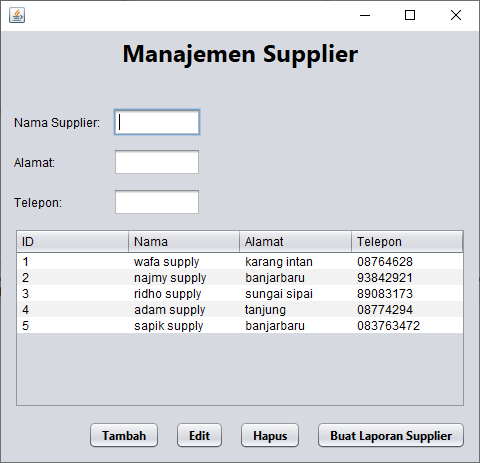
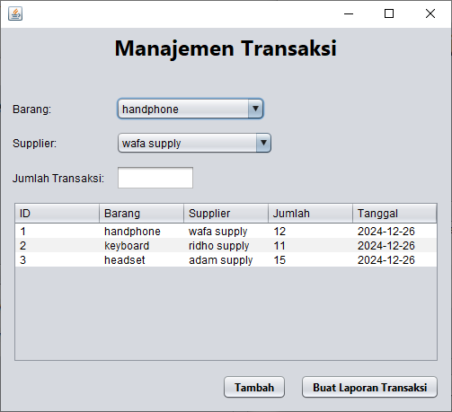
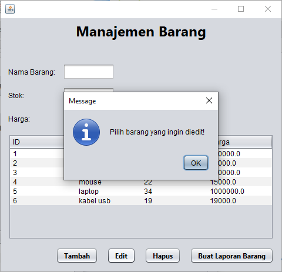
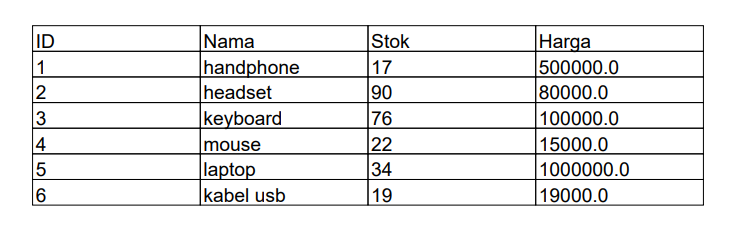
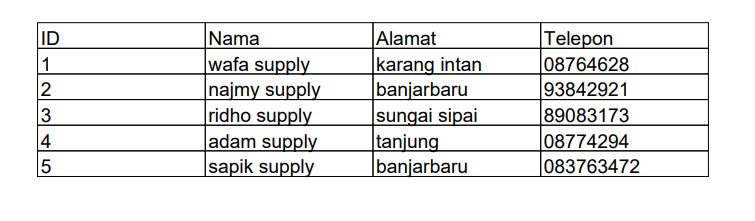
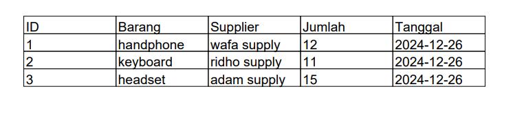

# Aplikasi Manajemen Gudang

## Overview
Aplikasi Manajemen Inventaris ini dirancang untuk merampingkan dan mengelola operasi barang, pemasok, dan transaksi di gudang. Aplikasi ini dibangun dengan menggunakan**Java Swing** untuk antarmuka pengguna dan **MYSQl** sebagai basis data, memberikan solusi yang sederhana namun efisien untuk gudang kecil hingga menengah.

---

## Fitur

### 1. **Manajemen Barang**
- Tambah, Edit, and Hapus Barang.
- Inputan: `Nama Barang`, `Stok`, and `Harga`.
- Pembaruan data secara real-time dalam daftar inventaris.

### 2. **Manajemen Supplier**
- Mengelola pemasok dengan menambahkan, memperbarui, dan menghapus detail pemasok.
- Inputan: `Nama Supplier`, `Alamat`, and `Nomor Telepon`.

### 3. **Manajemen Transaksi**
- Catat transaksi dengan memilih:
  - `Barang` (dari combobox).
  - `Supplier` (dari combobox).
  - `Jumlah Transaksi` (memasukkan jumlah transaksi).

### 4. **Laporan**
- Menghasilkan laporan terperinci:
  - **Laporan Transaksi**: All transaction records.
  - **Laporan Barang**: List of items with their stock and price.
  - **Laporan Supplier**: Contact details of all suppliers.

---

## Teknologi yang digunakan
- **Bahasa Pemrograman**: Java
- **GUI Framework**: Swing
- **Database**: MYSQL
- **IDE**: NetBeans

---

## Installation
1. Clone the repository:
   ```bash
   git clone https://github.com/yourusername/inventory-management-app.git
   ```
2. Buka proyek di NetBeans.
3. Pastikan SQLite telah terinstal dan terkonfigurasi dengan benar.
4. Jalankan aplikasi.

---

## Cara Menggunakan
1. **Manajemen Barang**:
- Buka tab "Barang".
- Tambahkan barang baru dengan stok dan harganya.
- Memperbarui atau menghapus item yang ada sesuai kebutuhan.


2. **Manajemen Pemasok**:
- Buka tab "Pemasok".
- Tambahkan detail pemasok termasuk alamat dan nomor telepon.
- Edit atau hapus pemasok jika perlu.


3. **Manajemen Transaksi**:
- Buka tab "Transaksi".
- Pilih`Barang` dan`Supplier` dari menu tarik-turun.
- Masukkan`Jumlah Transaksi` dan klik "Tambah".


4. **Laporan**:
- Mengakses laporan melalui menu "Laporan".
- Pilih jenis laporan yang diinginkan dan lihat dalam format tabel atau ekspor sesuai kebutuhan.

---

## Screenshots

### 1. Menu Utama Aplikasi Gudang
  

### 2. Form Manajemen Barang
  

### 3. Form Manajemen Supplier
  

### 4. Form Manajemen Transaksi
  

### 5. Memvalidasi bahwa Nama Barang belum diisi
  

### 6. Memvalidasi bahwa baris yang ingin diedit belum dipilih
  

### 7. Memvalidasi bahwa baris yang ingin dihapus belum dipilih
  

### 8. Laporan barang dalam bentuk file PDF
  

### 9. Laporan supplier dalam bentuk file PDF
  

### 10. Laporan transaksi dalam bentuk file PDF
  

---

## Contact
For questions or support, please contact:
- **Name**: Muhammad Husnu Elwafa
- **Email**: hsnlwfa15@gmail.com
